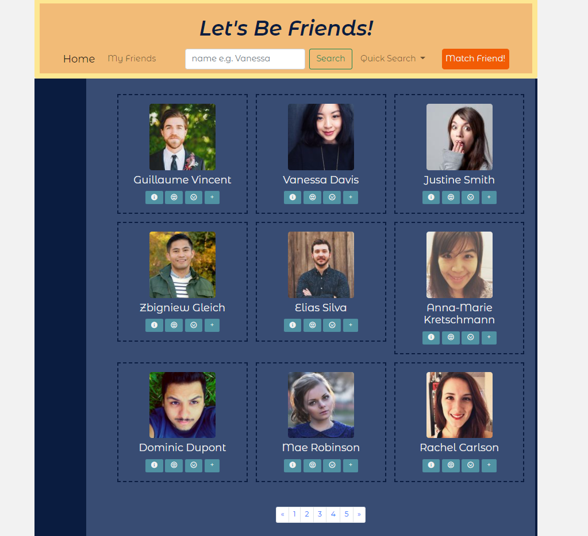
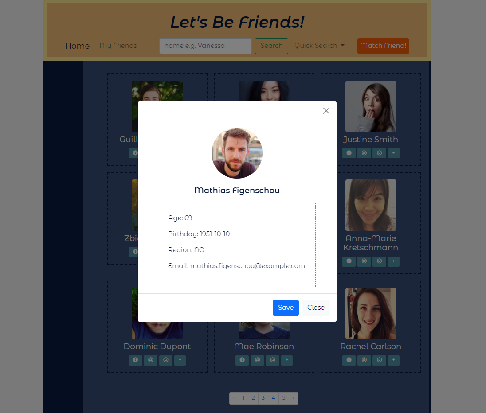

# Let's Be Friends #
### A web for you to meet new friends! ###

### What can it do? ###
#### Browse and Group Friends ####
- You can browse information of up to 200 people created from our API!

  (If you have your own data, feel free to customize it! )
- You can like/dislike people by pressing the __smile-face button/sad-face button__.
- You can add people to __My Friends__,and email them directly in __My Friends__ page.

#### Search Friends ####
- Have some names in mind? You can use __Search Bar__ to search people!
- Tired of browsing irrelevant results? Through __Quick Search__, you could find people based on __gender__, you could also see who you've liked before! 

   ***(Caution: the data of like/dislike won't be saved in the browser, so unfortunately, for now, when you click another page, the data might be lost... )***

#### Match Friend for You ####
- Want to meet people randomly? Press __Match Friend!__ to see a randomly-picked friend!

